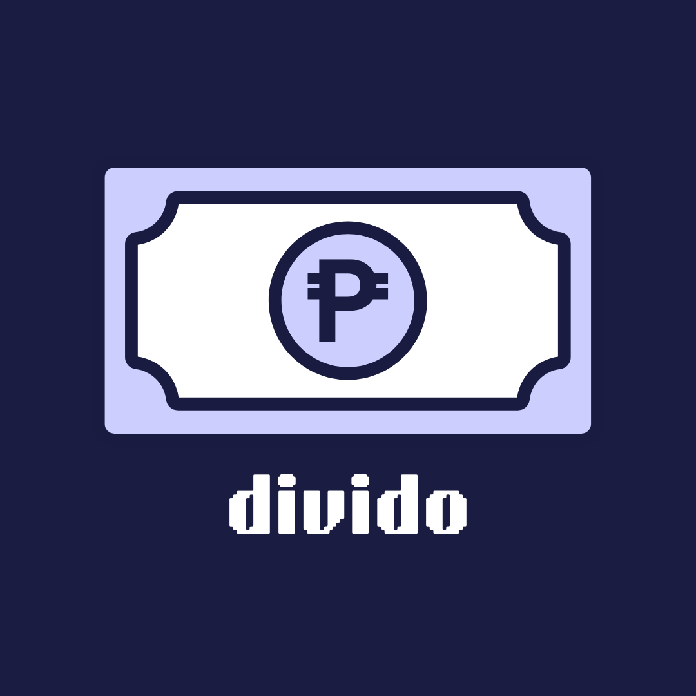

<div align="center">
  
  <h1>Divido</h1>
  <p>
    A Flutter + Supabase Progressive Web App for tracking and splitting shared expenses across groups.
  </p>
</div>

<p align="center">
  <a href="https://flutter.dev/">
    
  </a>
  <a href="https://supabase.com/">
    
  </a>
  <a href="https://web.dev/progressive-web-apps/">
    
  </a>
  <a href="LICENSE">
    
  </a>
</p>
 
<p align="center">
  Divido is a <strong>Flutter-powered Progressive Web App</strong> for tracking and splitting shared expenses
  with friends, family, or roommates.
  It uses <strong>Supabase</strong> for authentication and data storage, and can be installed to your home
  screen on mobile or desktop as a PWA.
</p>

## ✨ Features

- **Authentication**
  - Username-based login (backed by email in Supabase)
  - Registration with first name, last name, email, username, password and a personal color
  - Session restoration on app start

- **Expense Management**
  - Create expenses with a title and total amount
  - Split equally between participants or set **custom amounts per payer**
  - View all expenses, your own expenses, and an overall balance view
  - Expenses and breakdowns persisted in Supabase tables (`expenses`, `expense_breakdowns`, `profiles`)

- **UI / UX**
  - Modern dark theme optimized for mobile and desktop
  - Bottom navigation with tabs: **All**, **Mine**, **Balance**
  - Floating action button to quickly add a new expense

- **PWA**
  - Installable web app via browser (standalone display mode)
  - Web manifest, icons, and favicon configured in `web/`

## 🛠 Tech Stack

- **Framework**: Flutter (`lib/`)
- **Platform Targets**: Web (PWA), Android, Windows, Linux
- **Backend**: Supabase (`supabase_flutter`)
- **State Management**: `provider` (`ExpenseProvider`)
- **Env & Config**: `flutter_dotenv` with `.env` bundled from `assets/.env`

## 🚀 Getting Started

### ✅ Prerequisites

- Flutter SDK (3.11.0 or compatible, as defined in `pubspec.yaml`)
- A Supabase project with:
  - `SUPABASE_URL`
  - `SUPABASE_ANON_KEY`

### 1. Clone & Install Dependencies

```bash
git clone https://github.com/Reno-03/divido-app.git
cd divido_app
flutter pub get
```

### 2. Configure Environment Variables

Create the file `assets/.env` (already referenced in `pubspec.yaml`) with at least:

```bash
SUPABASE_URL=your_supabase_url
SUPABASE_ANON_KEY=your_supabase_anon_key
```

### 3. Run the App (Web PWA)

```bash
flutter run -d chrome
```

- The app will start in your browser.
- You can also run on mobile/desktop devices using the appropriate Flutter devices.

## 📦 Building for Web / PWA

### 🧱 Build

```bash
flutter build web --release
```

This produces a static web build in `build/web/` that includes all PWA assets (manifest, icons, service worker, etc.).

### 🌐 Deploy

- The app can be hosted on **any static hosting provider** (e.g. Vercel, Netlify, GitHub Pages).
- A `vercel.json` file is present for Vercel configuration; you can deploy by pointing Vercel to the `build/web` output.


## 🧩 Development Notes

- Initial route is determined by whether there is an active Supabase auth session.
- The `ExpenseProvider` fetches data from Supabase and exposes it via `ChangeNotifier`.
- The app is designed primarily for **portrait** usage and touch devices but also supports mouse/trackpad inputs on desktop/web.


## 📄 License

This project includes a `LICENSE` file; see it for details on usage and redistribution.
